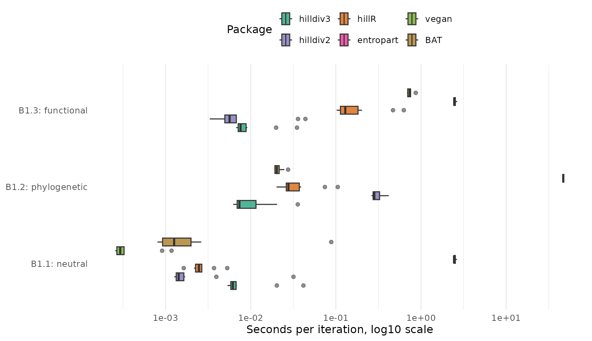
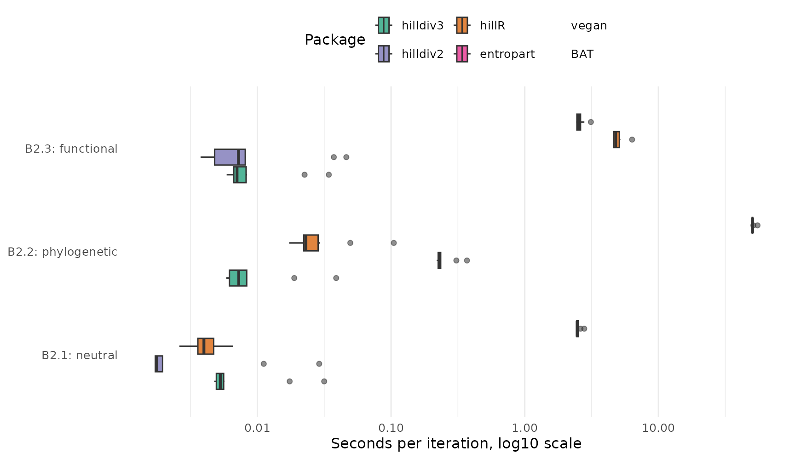
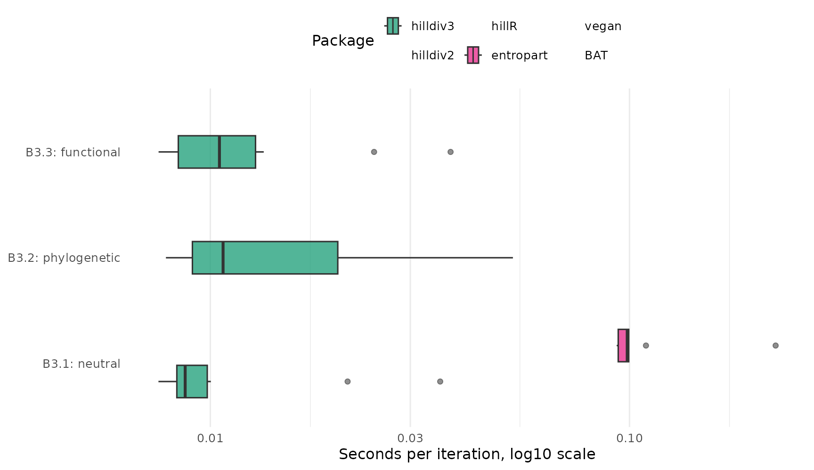
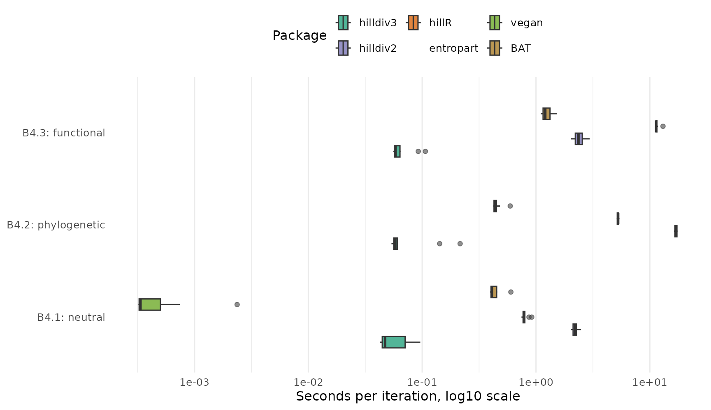

# Performance benchmarks

The benchmark suite compares `hilldiv3` with the legacy `hilldiv2` code
and the external packages `hillR`, `entropart`, `vegan` and `BAT`.

## Benchmark results

| n_taxa | n_samples | iterations | backend |
|-------:|----------:|-----------:|:--------|
|    200 |        50 |         10 | bench   |

Benchmark configuration {.table}

## B1: Alpha diversity



## B2: Diversity partitioning without hierarchy



## B3: Nested diversity partitioning



## B4: Pairwise beta diversity matrix



## Support and Detail

The goal is not to force every package into the same table when the
operation is not equivalent. Each package-operation row is labelled as:

| Status | Meaning |
|----|----|
| `yes` | The package has a directly comparable operation. |
| `partial` | The package has a related operation, but the output or statistical definition differs. |
| `no` | The package does not expose that operation. |
| `unavailable` | The package was not installed when the benchmark was run. |
| `failed` | The package was installed, but the benchmark call errored. |
| `out_of_memory` | The benchmark call exceeded the memory limit and was stopped. |

### Support matrix

| Benchmark | Operation | Facet | Package | Support | Note |
|:---|:---|:---|:---|:---|:---|
| B1.1 | Alpha diversity at q = 0, 1, 2 | neutral | hilldiv3 | yes | Direct hilldiv3 call. |
| B1.1 | Alpha diversity at q = 0, 1, 2 | neutral | hilldiv2 | yes | Direct hilldiv2 call. |
| B1.1 | Alpha diversity at q = 0, 1, 2 | neutral | hillR | yes | Taxonomic Hill numbers via hill_taxa(). |
| B1.1 | Alpha diversity at q = 0, 1, 2 | neutral | entropart | yes | Neutral alpha diversity via AlphaDiversity(). |
| B1.1 | Alpha diversity at q = 0, 1, 2 | neutral | vegan | yes | Neutral Hill numbers via renyi(…, hill = TRUE). |
| B1.1 | Alpha diversity at q = 0, 1, 2 | neutral | BAT | yes | Neutral Hill numbers via hill(). |
| B1.2 | Alpha diversity at q = 0, 1, 2 | phylogenetic | hilldiv3 | yes | Direct hilldiv3 call. |
| B1.2 | Alpha diversity at q = 0, 1, 2 | phylogenetic | hilldiv2 | yes | Direct hilldiv2 call. |
| B1.2 | Alpha diversity at q = 0, 1, 2 | phylogenetic | hillR | yes | Phylogenetic Hill numbers via hill_phylo(). |
| B1.2 | Alpha diversity at q = 0, 1, 2 | phylogenetic | entropart | partial | Phylogenetic alpha requires an ultrametric tree and returns entropart’s normalized phylodiversity. |
| B1.2 | Alpha diversity at q = 0, 1, 2 | phylogenetic | vegan | no | vegan does not compute phylogenetic Hill numbers. |
| B1.2 | Alpha diversity at q = 0, 1, 2 | phylogenetic | BAT | partial | BAT::alpha() computes Faith-style PD richness, not q = 0, 1, 2 phylogenetic Hill numbers. |
| B1.3 | Alpha diversity at q = 0, 1, 2 | functional | hilldiv3 | yes | Direct hilldiv3 call. |
| B1.3 | Alpha diversity at q = 0, 1, 2 | functional | hilldiv2 | yes | Direct hilldiv2 call. |
| B1.3 | Alpha diversity at q = 0, 1, 2 | functional | hillR | yes | Functional Hill numbers via hill_func(). |
| B1.3 | Alpha diversity at q = 0, 1, 2 | functional | entropart | partial | Similarity-based alpha uses Z, not hilldiv3’s distance-threshold functional definition. |
| B1.3 | Alpha diversity at q = 0, 1, 2 | functional | vegan | no | vegan does not compute functional Hill numbers. |
| B1.3 | Alpha diversity at q = 0, 1, 2 | functional | BAT | partial | BAT::alpha() computes tree-based functional richness, not q = 0, 1, 2 functional Hill numbers. |
| B2.1 | Diversity partitioning at q = 0, 1, 2 | neutral | hilldiv3 | yes | Direct hilldiv3 call. |
| B2.1 | Diversity partitioning at q = 0, 1, 2 | neutral | hilldiv2 | yes | Direct hilldiv2 call. |
| B2.1 | Diversity partitioning at q = 0, 1, 2 | neutral | hillR | yes | Partitioning via hill_taxa_parti(). |
| B2.1 | Diversity partitioning at q = 0, 1, 2 | neutral | entropart | yes | Metacommunity partitioning via DivPart(). |
| B2.1 | Diversity partitioning at q = 0, 1, 2 | neutral | vegan | no | No Hill alpha/gamma/beta partitioning API. |
| B2.1 | Diversity partitioning at q = 0, 1, 2 | neutral | BAT | no | No Hill alpha/gamma/beta partitioning API. |
| B2.2 | Diversity partitioning at q = 0, 1, 2 | phylogenetic | hilldiv3 | yes | Direct hilldiv3 call. |
| B2.2 | Diversity partitioning at q = 0, 1, 2 | phylogenetic | hilldiv2 | yes | Direct hilldiv2 call. |
| B2.2 | Diversity partitioning at q = 0, 1, 2 | phylogenetic | hillR | yes | Partitioning via hill_phylo_parti(). |
| B2.2 | Diversity partitioning at q = 0, 1, 2 | phylogenetic | entropart | partial | Phylogenetic partitioning requires an ultrametric tree and uses entropart’s normalization. |
| B2.2 | Diversity partitioning at q = 0, 1, 2 | phylogenetic | vegan | no | No phylogenetic Hill partitioning API. |
| B2.2 | Diversity partitioning at q = 0, 1, 2 | phylogenetic | BAT | no | No phylogenetic Hill alpha/gamma/beta partitioning API. |
| B2.3 | Diversity partitioning at q = 0, 1, 2 | functional | hilldiv3 | yes | Direct hilldiv3 call. |
| B2.3 | Diversity partitioning at q = 0, 1, 2 | functional | hilldiv2 | yes | Direct hilldiv2 call. |
| B2.3 | Diversity partitioning at q = 0, 1, 2 | functional | hillR | yes | Partitioning via hill_func_parti(). |
| B2.3 | Diversity partitioning at q = 0, 1, 2 | functional | entropart | partial | Similarity-based partitioning uses Z, not hilldiv3’s distance-threshold functional definition. |
| B2.3 | Diversity partitioning at q = 0, 1, 2 | functional | vegan | no | No functional Hill partitioning API. |
| B2.3 | Diversity partitioning at q = 0, 1, 2 | functional | BAT | no | No functional Hill alpha/gamma/beta partitioning API. |
| B3.1 | Nested diversity partitioning at q = 0, 1, 2 | neutral | hilldiv3 | yes | Direct hilldiv3 call. |
| B3.1 | Nested diversity partitioning at q = 0, 1, 2 | neutral | hilldiv2 | no | No nested hierarchy argument in hilldiv2. |
| B3.1 | Nested diversity partitioning at q = 0, 1, 2 | neutral | hillR | no | No nested hierarchy argument in hillR. |
| B3.1 | Nested diversity partitioning at q = 0, 1, 2 | neutral | entropart | partial | MergeMC supports hierarchical metacommunities, but not the same formula API/output. |
| B3.1 | Nested diversity partitioning at q = 0, 1, 2 | neutral | vegan | no | No nested Hill partitioning API. |
| B3.1 | Nested diversity partitioning at q = 0, 1, 2 | neutral | BAT | no | No nested Hill partitioning API. |
| B3.2 | Nested diversity partitioning at q = 0, 1, 2 | phylogenetic | hilldiv3 | yes | Direct hilldiv3 call. |
| B3.2 | Nested diversity partitioning at q = 0, 1, 2 | phylogenetic | hilldiv2 | no | No nested hierarchy argument in hilldiv2. |
| B3.2 | Nested diversity partitioning at q = 0, 1, 2 | phylogenetic | hillR | no | No nested hierarchy argument in hillR. |
| B3.2 | Nested diversity partitioning at q = 0, 1, 2 | phylogenetic | entropart | no | No matching nested phylogenetic hierarchy API. |
| B3.2 | Nested diversity partitioning at q = 0, 1, 2 | phylogenetic | vegan | no | No nested phylogenetic Hill partitioning API. |
| B3.2 | Nested diversity partitioning at q = 0, 1, 2 | phylogenetic | BAT | no | No nested phylogenetic Hill partitioning API. |
| B3.3 | Nested diversity partitioning at q = 0, 1, 2 | functional | hilldiv3 | yes | Direct hilldiv3 call. |
| B3.3 | Nested diversity partitioning at q = 0, 1, 2 | functional | hilldiv2 | no | No nested hierarchy argument in hilldiv2. |
| B3.3 | Nested diversity partitioning at q = 0, 1, 2 | functional | hillR | no | No nested hierarchy argument in hillR. |
| B3.3 | Nested diversity partitioning at q = 0, 1, 2 | functional | entropart | no | No matching nested functional hierarchy API. |
| B3.3 | Nested diversity partitioning at q = 0, 1, 2 | functional | vegan | no | No nested functional Hill partitioning API. |
| B3.3 | Nested diversity partitioning at q = 0, 1, 2 | functional | BAT | no | No nested functional Hill partitioning API. |
| B4.1 | Pairwise beta diversity matrix at q = 1 | neutral | hilldiv3 | yes | Direct hilldiv3 call. |
| B4.1 | Pairwise beta diversity matrix at q = 1 | neutral | hilldiv2 | yes | Direct hilldiv2 call. |
| B4.1 | Pairwise beta diversity matrix at q = 1 | neutral | hillR | yes | Pairwise partitioning via hill_taxa_parti_pairwise(). |
| B4.1 | Pairwise beta diversity matrix at q = 1 | neutral | entropart | no | No direct all-pairs Hill dissimilarity API. |
| B4.1 | Pairwise beta diversity matrix at q = 1 | neutral | vegan | partial | Pairwise Bray-Curtis distance; related, but not Hill-number dissimilarity. |
| B4.1 | Pairwise beta diversity matrix at q = 1 | neutral | BAT | partial | Pairwise Jaccard/Sorensen beta components, not Hill-number dissimilarity. |
| B4.2 | Pairwise beta diversity matrix at q = 1 | phylogenetic | hilldiv3 | yes | Direct hilldiv3 call. |
| B4.2 | Pairwise beta diversity matrix at q = 1 | phylogenetic | hilldiv2 | yes | Direct hilldiv2 call. |
| B4.2 | Pairwise beta diversity matrix at q = 1 | phylogenetic | hillR | yes | Pairwise partitioning via hill_phylo_parti_pairwise(). |
| B4.2 | Pairwise beta diversity matrix at q = 1 | phylogenetic | entropart | no | No direct all-pairs Hill dissimilarity API. |
| B4.2 | Pairwise beta diversity matrix at q = 1 | phylogenetic | vegan | no | No phylogenetic Hill pairwise dissimilarity API. |
| B4.2 | Pairwise beta diversity matrix at q = 1 | phylogenetic | BAT | partial | Pairwise PD beta components, not Hill-number dissimilarity. |
| B4.3 | Pairwise beta diversity matrix at q = 1 | functional | hilldiv3 | yes | Direct hilldiv3 call. |
| B4.3 | Pairwise beta diversity matrix at q = 1 | functional | hilldiv2 | yes | Direct hilldiv2 call. |
| B4.3 | Pairwise beta diversity matrix at q = 1 | functional | hillR | yes | Pairwise partitioning via hill_func_parti_pairwise(). |
| B4.3 | Pairwise beta diversity matrix at q = 1 | functional | entropart | no | No direct all-pairs Hill dissimilarity API. |
| B4.3 | Pairwise beta diversity matrix at q = 1 | functional | vegan | no | No functional Hill pairwise dissimilarity API. |
| B4.3 | Pairwise beta diversity matrix at q = 1 | functional | BAT | partial | Pairwise FD beta components, not Hill-number dissimilarity. |

### Timing and memory

Rows marked `partial` are timed because they are useful context, but
they should not be interpreted as exact replacements for the
corresponding `hilldiv3` operation. Peak memory is the maximum resident
set size (RSS) of the forked worker process during the run, so it
includes the base R session and loaded packages, not only the
operation’s own allocations.

| Benchmark | Operation | Facet | Package | Support | Median seconds | Relative to hilldiv3 | Peak memory (RSS) | Result size | Error |
|:---|:---|:---|:---|:---|:---|:---|:---|:---|:---|
| B1.1 | Alpha diversity at q = 0, 1, 2 | neutral | hilldiv3 | yes | 0.0062 | 1x | 354 MB | 5.4 KB |  |
| B1.1 | Alpha diversity at q = 0, 1, 2 | neutral | hilldiv2 | yes | 0.0014 | 0.23x | 3 MB | 5.4 KB |  |
| B1.1 | Alpha diversity at q = 0, 1, 2 | neutral | hillR | yes | 0.0025 | 0.4x | 6.1 MB | 12.2 KB |  |
| B1.1 | Alpha diversity at q = 0, 1, 2 | neutral | entropart | yes | 2.4423 | 395.08x | 551 MB | 30.1 KB |  |
| B1.1 | Alpha diversity at q = 0, 1, 2 | neutral | vegan | yes | 0.0003 | 0.05x | 2.8 MB | 5.7 KB |  |
| B1.1 | Alpha diversity at q = 0, 1, 2 | neutral | BAT | yes | 0.0013 | 0.21x | 335 MB | 13.4 KB |  |
| B1.2 | Alpha diversity at q = 0, 1, 2 | phylogenetic | hilldiv3 | yes | 0.0074 | 1x | 349.5 MB | 5.4 KB |  |
| B1.2 | Alpha diversity at q = 0, 1, 2 | phylogenetic | hilldiv2 | yes | 0.2831 | 38.32x | 541.2 MB | 5.4 KB |  |
| B1.2 | Alpha diversity at q = 0, 1, 2 | phylogenetic | hillR | yes | 0.0278 | 3.76x | 426.1 MB | 12.4 KB |  |
| B1.2 | Alpha diversity at q = 0, 1, 2 | phylogenetic | entropart | partial | 46.7978 | 6335.12x | 577.4 MB | 30.7 KB |  |
| B1.2 | Alpha diversity at q = 0, 1, 2 | phylogenetic | BAT | partial | 0.0203 | 2.74x | 439.3 MB | 4.5 KB |  |
| B1.3 | Alpha diversity at q = 0, 1, 2 | functional | hilldiv3 | yes | 0.0076 | 1x | 348.8 MB | 5.4 KB |  |
| B1.3 | Alpha diversity at q = 0, 1, 2 | functional | hilldiv2 | yes | 0.0057 | 0.74x | 381.8 MB | 5.4 KB |  |
| B1.3 | Alpha diversity at q = 0, 1, 2 | functional | hillR | yes | 0.1291 | 16.97x | 593.9 MB | 18.9 KB |  |
| B1.3 | Alpha diversity at q = 0, 1, 2 | functional | entropart | partial | 2.4548 | 322.74x | 632.4 MB | 30.7 KB |  |
| B1.3 | Alpha diversity at q = 0, 1, 2 | functional | BAT | partial | 0.7368 | 96.87x | 503.5 MB | 4.5 KB |  |
| B2.1 | Diversity partitioning at q = 0, 1, 2 | neutral | hilldiv3 | yes | 0.0053 | 1x | 343.9 MB | 1016 B |  |
| B2.1 | Diversity partitioning at q = 0, 1, 2 | neutral | hilldiv2 | yes | 0.0018 | 0.34x | 3.2 MB | 1016 B |  |
| B2.1 | Diversity partitioning at q = 0, 1, 2 | neutral | hillR | yes | 0.0040 | 0.75x | 197.7 MB | 4.7 KB |  |
| B2.1 | Diversity partitioning at q = 0, 1, 2 | neutral | entropart | yes | 2.4650 | 466.91x | 544.7 MB | 35.1 KB |  |
| B2.2 | Diversity partitioning at q = 0, 1, 2 | phylogenetic | hilldiv3 | yes | 0.0073 | 1x | 341.5 MB | 1016 B |  |
| B2.2 | Diversity partitioning at q = 0, 1, 2 | phylogenetic | hilldiv2 | yes | 0.2313 | 31.89x | 557.5 MB | 1016 B |  |
| B2.2 | Diversity partitioning at q = 0, 1, 2 | phylogenetic | hillR | yes | 0.0231 | 3.18x | 434.6 MB | 4.3 KB |  |
| B2.2 | Diversity partitioning at q = 0, 1, 2 | phylogenetic | entropart | partial | 50.6067 | 6975x | 597.1 MB | 89.3 KB |  |
| B2.3 | Diversity partitioning at q = 0, 1, 2 | functional | hilldiv3 | yes | 0.0070 | 1x | 342.2 MB | 1016 B |  |
| B2.3 | Diversity partitioning at q = 0, 1, 2 | functional | hilldiv2 | yes | 0.0072 | 1.03x | 390.8 MB | 1016 B |  |
| B2.3 | Diversity partitioning at q = 0, 1, 2 | functional | hillR | yes | 4.7919 | 680.65x | 2.81 GB | 4.7 KB |  |
| B2.3 | Diversity partitioning at q = 0, 1, 2 | functional | entropart | partial | 2.5322 | 359.68x | 494 MB | 35.6 KB |  |
| B3.1 | Nested diversity partitioning at q = 0, 1, 2 | neutral | hilldiv3 | yes | 0.0087 | 1x | 349.2 MB | 1.1 KB |  |
| B3.1 | Nested diversity partitioning at q = 0, 1, 2 | neutral | entropart | partial | 0.0988 | 11.34x | 398.8 MB | 4.1 KB |  |
| B3.2 | Nested diversity partitioning at q = 0, 1, 2 | phylogenetic | hilldiv3 | yes | 0.0107 | 1x | 431.2 MB | 1.1 KB |  |
| B3.3 | Nested diversity partitioning at q = 0, 1, 2 | functional | hilldiv3 | yes | 0.0105 | 1x | 414.1 MB | 1.1 KB |  |
| B4.1 | Pairwise beta diversity matrix at q = 1 | neutral | hilldiv3 | yes | 0.0472 | 1x | 461.2 MB | 14 KB |  |
| B4.1 | Pairwise beta diversity matrix at q = 1 | neutral | hilldiv2 | yes | 2.2128 | 46.84x | 478 MB | 14 KB |  |
| B4.1 | Pairwise beta diversity matrix at q = 1 | neutral | hillR | yes | 0.7855 | 16.63x | 499.4 MB | 84.4 KB |  |
| B4.1 | Pairwise beta diversity matrix at q = 1 | neutral | vegan | partial | 0.0003 | 0.01x | 2.9 MB | 15.5 KB |  |
| B4.1 | Pairwise beta diversity matrix at q = 1 | neutral | BAT | partial | 0.4095 | 8.67x | 518 MB | 74.9 KB |  |
| B4.2 | Pairwise beta diversity matrix at q = 1 | phylogenetic | hilldiv3 | yes | 0.0581 | 1x | 527.3 MB | 14 KB |  |
| B4.2 | Pairwise beta diversity matrix at q = 1 | phylogenetic | hilldiv2 | yes | 16.8906 | 290.9x | 573.7 MB | 14 KB |  |
| B4.2 | Pairwise beta diversity matrix at q = 1 | phylogenetic | hillR | yes | 5.2637 | 90.65x | 631.9 MB | 84.4 KB |  |
| B4.2 | Pairwise beta diversity matrix at q = 1 | phylogenetic | BAT | partial | 0.4389 | 7.56x | 561.4 MB | 74.9 KB |  |
| B4.3 | Pairwise beta diversity matrix at q = 1 | functional | hilldiv3 | yes | 0.0583 | 1x | 536.1 MB | 14 KB |  |
| B4.3 | Pairwise beta diversity matrix at q = 1 | functional | hilldiv2 | yes | 2.3603 | 40.5x | 644.8 MB | 14 KB |  |
| B4.3 | Pairwise beta diversity matrix at q = 1 | functional | hillR | yes | 11.3817 | 195.31x | 712.5 MB | 84.4 KB |  |
| B4.3 | Pairwise beta diversity matrix at q = 1 | functional | BAT | partial | 1.2050 | 20.68x | 536 MB | 74.9 KB |  |

## Reproducing the benchmark

Install the comparison packages, then run the benchmark script from the
package root:

``` r

install.packages(c("bench", "hillR", "entropart", "vegan", "BAT"))
remotes::install_github("anttonalberdi/hilldiv2")

Sys.setenv(
  BENCH_ITERATIONS = 10,
  BENCH_N_TAXA = 200,
  BENCH_N_SAMPLES = 50
)
source("inst/benchmarks/run-benchmarks.R")
```

The script writes:

| File | Contents |
|----|----|
| `inst/benchmarks/results/performance.csv` | Per-iteration support, timing and memory table. |
| `inst/benchmarks/results/performance-summary.csv` | Aggregated timing and memory summary table. |
| `inst/benchmarks/results/performance-times.csv` | Compatibility copy of the per-iteration table for boxplots. |
| `inst/benchmarks/results/session-info.txt` | R version, platform and package versions. |

Adjust `BENCH_ITERATIONS`, `BENCH_N_TAXA` or `BENCH_N_SAMPLES` to scale
the run. Each call runs in a forked worker capped at
`BENCH_MEMORY_LIMIT_GB` (default 10); a call that exceeds it is stopped
and reported as `out_of_memory`. Keep `session-info.txt` with the
published results because benchmark times depend on hardware, BLAS, R
version and package versions.

## Notes on equivalence

`hillR` is the closest external comparator for Hill-number alpha
diversity, partitioning and pairwise comparisons across taxonomic,
phylogenetic and functional diversity.

`entropart` supports metacommunity alpha, beta and gamma diversity,
including phylogenetic and similarity-based diversity, but some outputs
and assumptions differ from the `hilldiv3` API.

`vegan` provides neutral Hill numbers through Renyi diversity and many
pairwise community dissimilarities, but it does not implement the
phylogenetic, functional or Hill-number S/C/U/V dissimilarity operations
used by `hilldiv3`.

`BAT` includes biodiversity assessment tools for taxonomic, phylogenetic
and functional diversity. Its Hill-number function is a neutral
alpha-diversity comparator; its beta-diversity tools are related but not
the same Hill-number partition/dissimilarity operations.

## Session info

``` text
R version 4.3.3 (2024-02-29)
Platform: aarch64-apple-darwin20 (64-bit)
Running under: macOS 15.6.1

Matrix products: default
BLAS:   /Library/Frameworks/R.framework/Versions/4.3-arm64/Resources/lib/libRblas.0.dylib 
LAPACK: /Library/Frameworks/R.framework/Versions/4.3-arm64/Resources/lib/libRlapack.dylib;  LAPACK version 3.11.0

locale:
[1] C

time zone: Europe/Copenhagen
tzcode source: internal

attached base packages:
[1] stats     graphics  grDevices utils     datasets  methods   base     

other attached packages:
[1] tibble_3.3.1        tidyr_1.3.2         dplyr_1.2.1        
[4] hilldiv3_3.0.0.9000 testthat_3.3.2     

loaded via a namespace (and not attached):
  [1] RColorBrewer_1.1-3      subplex_1.9             magrittr_2.0.5         
  [4] farver_2.1.2            vctrs_0.7.3             RCurl_1.98-1.16        
  [7] terra_1.8-54            progress_1.2.3          DEoptim_2.2-8          
 [10] deSolve_1.40            pROC_1.19.0.1           caret_7.0-1            
 [13] parallelly_1.47.0       pracma_2.4.6            KernSmooth_2.23-26     
 [16] desc_1.4.3              plyr_1.8.9              hillR_0.5.2            
 [19] palmerpenguins_0.1.1    lubridate_1.9.5         hilldiv2_2.0.5         
 [22] igraph_2.1.1            lifecycle_1.0.5         iterators_1.0.14       
 [25] pkgconfig_2.0.3         Matrix_1.6-5            R6_2.6.1               
 [28] rbibutils_2.4.1         future_1.70.0           magic_1.6-1            
 [31] digest_0.6.39           numDeriv_2016.8-1.1     colorspace_2.1-2       
 [34] ps_1.9.3                rprojroot_2.1.1         pkgload_1.5.1          
 [37] vegan_2.6-8             pdist_1.2.1             clusterGeneration_1.3.8
 [40] timechange_0.4.0        abind_1.4-8             mgcv_1.9-1             
 [43] compiler_4.3.3          proxy_0.4-29            withr_3.0.2            
 [46] bit64_4.8.0             doParallel_1.0.17       S7_0.2.1-1             
 [49] optimParallel_1.0-2     pkgbuild_1.4.8          R.utils_2.13.0         
 [52] maps_3.4.3              MASS_7.3-60.0.1         lava_1.9.0             
 [55] scatterplot3d_0.3-45    permute_0.9-10          ModelMetrics_1.2.2.2   
 [58] tools_4.3.3             otel_0.2.0              ape_5.8-1              
 [61] entropart_1.6-16        phytools_2.5-2          future.apply_1.20.2    
 [64] nnet_7.3-20             TreeTools_1.14.0        R.oo_1.27.1            
 [67] glue_1.8.1              quadprog_1.5-8          BAT_2.10.0             
 [70] nlme_3.1-166            R.cache_0.17.0          grid_4.3.3             
 [73] cluster_2.1.8.2         reshape2_1.4.5          PlotTools_0.3.1        
 [76] generics_0.1.4          recipes_1.3.2           gtable_0.3.6           
 [79] R.methodsS3_1.8.2       class_7.3-23            data.table_1.18.2.1    
 [82] hms_1.1.4               foreach_1.5.2           pillar_1.11.1          
 [85] stringr_1.6.0           splines_4.3.3           lattice_0.22-9         
 [88] survival_3.8-6          bit_4.6.0               ks_1.15.1              
 [91] tidyselect_1.2.1        stats4_4.3.3            expm_1.0-0             
 [94] hardhat_1.4.3           timeDate_4052.112       brio_1.1.5             
 [97] proto_1.0.0             stringi_1.8.7           geiger_2.0.11          
[100] codetools_0.2-20        cli_3.6.6               nls2_0.3-4             
[103] rpart_4.1.27            geometry_0.5.2          Rdpack_2.6.6           
[106] Rcpp_1.1.1-1            globals_0.19.1          tidyverse_2.0.0        
[109] coda_0.19-4.1           fastcluster_1.3.0       parallel_4.3.3         
[112] gower_1.0.2             ggplot2_4.0.2           prettyunits_1.2.0      
[115] mclust_6.1.1            bitops_1.0-9            listenv_0.10.1         
[118] phangorn_2.12.1         mvtnorm_1.3-1           ipred_0.9-15           
[121] e1071_1.7-17            scales_1.4.0            prodlim_2026.03.11     
[124] purrr_1.2.2             crayon_1.5.3            combinat_0.0-8         
[127] rlang_1.2.0             fastmatch_1.1-8         mnormt_2.1.1           
[130] hypervolume_3.1.6      
```
