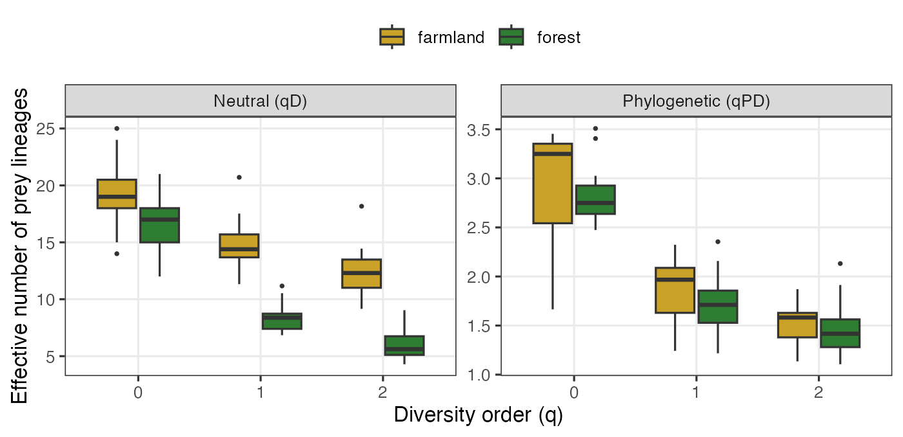
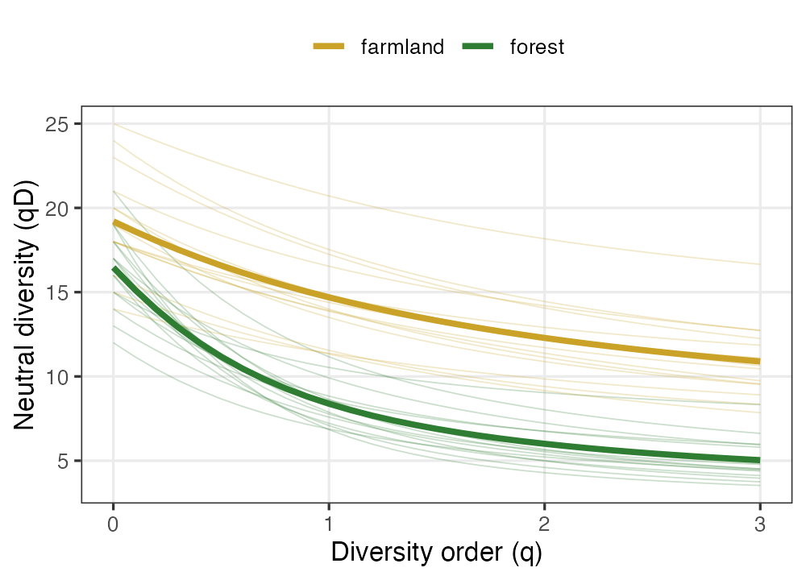
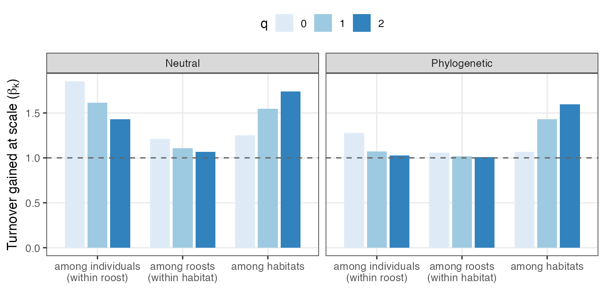

# Use case 1 — Dietary niches of insectivorous bats from prey ASVs

Dietary metabarcoding turns faecal or guano samples into a count table of prey
amplicon sequence variants (ASVs), and a question that immediately follows is
*how diverse, and how different, are the diets of the animals we sampled?*
Because the prey of a predator are an arbitrary slice of the tree of life,
counting ASVs alone can be misleading: a bat that takes twenty species of moth
has a taxon-rich but phylogenetically narrow diet, whereas a bat that takes a
beetle, a fly and a true bug eats fewer taxa spread across far more of the
insect phylogeny. `hilldiv3` makes both readings available from the same call,
and lets us ask *at which level of a nested sampling design* dietary turnover
actually occurs.

## Data

We simulate a typical guano-metabarcoding design (`data-bat-diet.R`): **50
insect-prey ASVs** detected across **30 individual bats**, nested as 5
individuals × 3 roosts × 2 contrasting foraging habitats (forest vs. farmland).
Prey ASVs belong to four insect orders, and their phylogeny has shallow
within-order clades on a deep order-level backbone. Forest bats are
specialists, concentrating on a single dominant moth (Lepidoptera) clade;
farmland bats are generalists spread evenly across Diptera, Coleoptera and
Hemiptera. Per-sample prey richness ranges from 12 to 25 ASVs — the sparse,
presence-driven structure typical of real diet data.

The count table has prey ASVs in rows and bats in columns; the prey phylogeny
is an `ape` tree whose tips match the rows.

```r
library(hilldiv3)

dim(bat_counts)        # 50 prey ASVs x 30 bats
bat_tree               # prey phylogeny (50 tips)
head(bat_metadata)     # habitat / roost / bat
```

## Neutral and phylogenetic diversity from one interface

`hilldiv()` returns Hill numbers per sample at diversity orders `q = 0`
(richness), `q = 1` (Shannon) and `q = 2` (Simpson). The computation is
cumulative: counts alone give neutral diversity, and adding `tree =` returns
neutral *and* phylogenetic diversity together in one tibble, tagged by a `type`
column. Pass `type =` to keep just one flavour.

```r
hilldiv(bat_counts, q = c(0, 1, 2))                    # neutral, qD
hilldiv(bat_counts, q = c(0, 1, 2), tree = bat_tree)   # neutral + phylogenetic
hilldiv(bat_counts, q = c(0, 1, 2), tree = bat_tree, type = "phylogenetic")  # qPD only
```



The two flavours tell complementary stories (means across individuals):

| | q | forest | farmland |
|---|---|---|---|
| Neutral `qD` | 0 | 16.5 | 19.2 |
| | 1 | 8.4 | 14.7 |
| | 2 | 6.0 | 12.3 |
| Phylogenetic `qPD` | 0 | 2.83 | 2.95 |
| | 1 | 1.72 | 1.85 |
| | 2 | 1.46 | 1.51 |

Forest specialists and farmland generalists differ only modestly in prey
*richness* (`q = 0`), but the gap widens sharply at higher `q`: at `q = 2` the
forest diet collapses to an effective ~6 prey ASVs against ~12 in farmland,
because a few dominant moths carry most of the forest reads. The phylogenetic
numbers show that the farmland diet is also consistently *broader across the
insect phylogeny* — the generalists span more of the prey tree of life even
where their taxon counts are similar.

## Diversity profiles make the dominance structure explicit

Reading diversity at a single `q` can mislead; a **diversity profile**,
`hillprof()`, traces `qD` continuously and exposes the whole evenness
structure in one curve.

```r
plot(hillprof(bat_counts, q = seq(0, 3, by = 0.1)))
```



The forest profiles fall away more steeply and sit lower — the signature of a
few dominant prey — while the farmland profiles decline gently from a higher
richness, the signature of a more even diet.
`hilleven()` condenses this into a single number; the mean `q = 2` evenness is
**0.37 in forest** against **0.64 in farmland**, confirming that forest diets
are dominated by a handful of moth ASVs.

```r
hilleven(bat_counts, q = 2)
```

## At which scale does the diet turn over?

A nested design asks a question a single alpha/beta split cannot answer: does
diet vary mostly *between individual bats*, *between roosts*, or *between
habitats*? `hillpart()` answers it directly with a one-sided `hierarchy`
formula, decomposing the pooled (gamma) diversity into one beta **per
hierarchical level**.

```r
hillpart(bat_counts, q = c(0, 1, 2),
         hierarchy = ~ habitat / roost, metadata = bat_metadata)
hillpart(bat_counts, q = c(0, 1, 2), tree = bat_tree,
         hierarchy = ~ habitat / roost, metadata = bat_metadata)
```



Each beta is the turnover *gained* at that scale, and the chain telescopes
exactly (`gamma = alpha_finest × ∏ beta`). The two flavours localise turnover
to different scales (betas at `q = 1`):

| Scale (turnover among…) | Neutral β | Phylogenetic β |
|---|---|---|
| individuals (within roost) | 1.61 | 1.07 |
| roosts (within habitat) | 1.11 | 1.02 |
| habitats | 1.55 | 1.43 |

Neutral turnover is split between *individuals* and *habitats*: bats sample
different exact prey ASVs from one mouthful to the next (high among-individual
turnover), and the two habitats offer different prey. But **phylogenetic**
turnover is concentrated almost entirely *between habitats* (β = 1.43) and is
negligible within them (β ≈ 1.0): individuals in the same habitat eat
phylogenetically interchangeable prey, while the forest and farmland diets are
drawn from genuinely different parts of the insect tree. This neutral-vs-
phylogenetic, scale-resolved contrast — available across all three diversity
types from one engine — is unique to `hilldiv3`.

## What this use case shows

From a single ASV table and a prey tree, `hilldiv3` delivered: per-sample
neutral and phylogenetic Hill numbers (`hilldiv`), full diversity profiles
(`hillprof`) and evenness (`hilleven`), and a scale-resolved nested partition of
turnover under both flavours (`hillpart` with a `hierarchy` formula) — a
complete dietary-diversity analysis through one consistent interface. The
neutral-versus-phylogenetic contrast, resolved across the whole diversity
profile *and* across every level of the nested design, is what lets a single
study say not just *how much* diets differ but *in what currency* and *at which
scale*.
