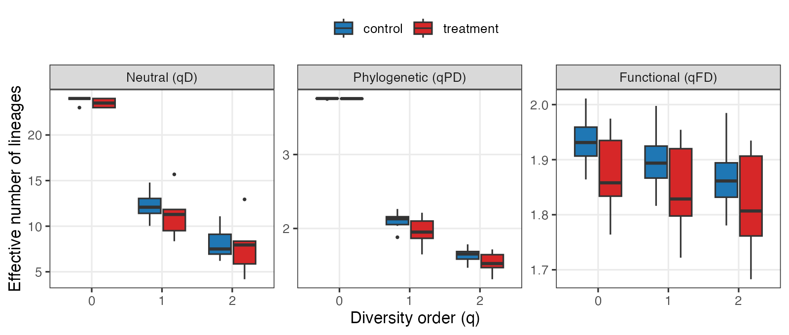
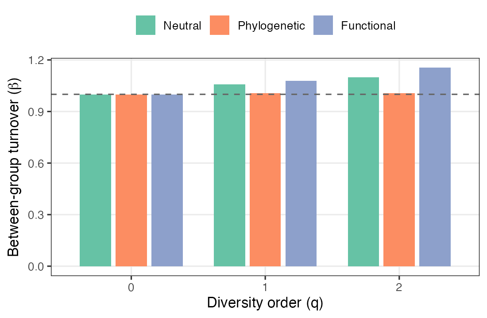
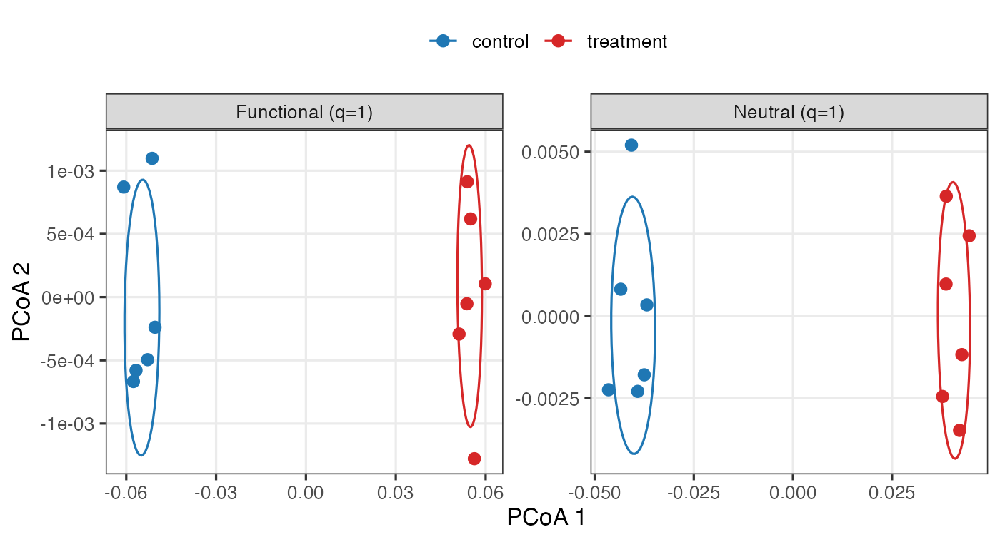
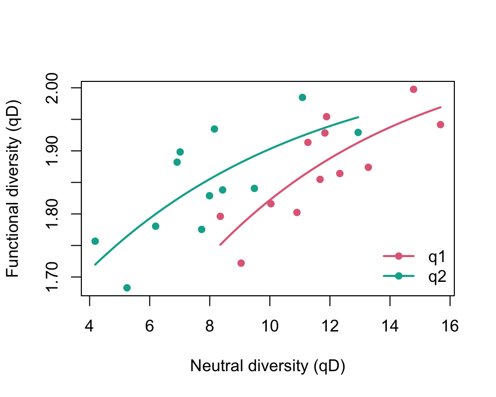

# Use case 2 — Three faces of diversity in a gut microbiome under intervention

Genome-resolved metagenomics summarises a microbial community as a table of
metagenome-assembled genome (MAG) abundances. Each MAG comes with two extra
layers of information that a raw count ignores: its **position on the bacterial
phylogeny** and its **functional attributes** (genome size, GC content, oxygen
tolerance, encoded capabilities). These layers can move independently: an
intervention can reshuffle *which* organisms — and *which lineages* — dominate a
community while leaving *what the community does* untouched, if the incoming
genomes are functionally equivalent to the ones they replace. `hilldiv3`
measures all three diversity flavours from the same count table and the same
function calls, so taxonomic, phylogenetic and functional change can be compared
on a common, interpretable scale (effective numbers of lineages) — and told
apart.

## Data

We use the bundled simulated data set: **24 MAGs across 12 host gut samples**,
split into a `control` and a `treatment` group of six. The MAGs fall into two
deep bacterial clades; the intervention **swaps which clade dominates** —
control guts are dominated by clade A, treatment guts by clade B — without
removing taxa (richness stays at 23–24 MAGs per sample). Crucially, clade B is a
*functional mirror* of clade A: for every genome in one clade there is a
genome in the other with the same trait profile. `gut_tree` is the genome
phylogeny and `gut_traits` a trait table mixing continuous (`genome_size`,
`gc_content`), categorical (`oxygen`) and binary (`motility`) attributes.

`traits2dist()` turns that mixed trait table into a functional distance with
Gower's coefficient, which handles the different variable types automatically:

```r
library(hilldiv3)

fdist <- traits2dist(gut_traits)   # Gower distance, range 0–1
```

## Neutral, phylogenetic and functional diversity from one call

The diversity *type* follows from what you supply, cumulatively: counts give
neutral, `tree =` adds phylogenetic, `dist =` adds functional. Supplying both a
tree and a distance matrix returns all three at once in a single tibble, with a
`type` column telling them apart; `type =` restricts the output. The interface
never changes.

```r
hilldiv(gut_counts, q = c(0, 1, 2))                                 # neutral, qD
hilldiv(gut_counts, q = c(0, 1, 2), tree = gut_tree)                # neutral + phylogenetic
hilldiv(gut_counts, q = c(0, 1, 2), tree = gut_tree, dist = fdist)  # all three at once
```



At the **alpha** (within-sample) level the two groups look almost identical in
every flavour (group means):

| | q | control | treatment |
|---|---|---|---|
| Neutral `qD` | 0 | 23.8 | 23.5 |
| | 1 | 12.3 | 11.3 |
| | 2 | 8.1 | 7.8 |
| Phylogenetic `qPD` | 1 | 2.10 | 1.96 |
| Functional `qFD` | 1 | 1.90 | 1.85 |

A single host carries about the same number of effective MAGs, spread over about
the same amount of the phylogeny and the same functional space, whether or not it
received the treatment — the group means differ by at most a few percent.
**Read at the alpha level alone, the intervention looks like it did almost
nothing.** The effect is not in *how much* diversity each gut holds, but in
*which* lineages hold it — a compositional change that only between-sample
(beta) analysis can see.

## Where does the community turn over — and where doesn't it?

`hillpart()` partitions diversity between the two groups and reports beta, the
effective number of distinct communities. Running it for each flavour shows
*which* axis the treatment shifts:

```r
md <- data.frame(group = rep(c("control", "treatment"), each = 6),
                 row.names = colnames(gut_counts))
hillpart(gut_counts, q = c(0, 1, 2), hierarchy = ~ group, metadata = md)              # neutral
hillpart(gut_counts, q = c(0, 1, 2), hierarchy = ~ group, metadata = md, tree = gut_tree) # phylogenetic
hillpart(gut_counts, q = c(0, 1, 2), hierarchy = ~ group, metadata = md, dist = fdist) # functional
```



Between-group beta grows strongly with `q` for the **neutral** (1.00 → 1.40 →
1.62) **and phylogenetic** (1.00 → 1.38 → 1.57) decompositions, but stays
essentially flat for the **functional** one (β ≈ 1.01 throughout). The clade swap
replaces the dominant genomes with phylogenetically distant ones — so taxonomic
*and* evolutionary composition turn over almost in lock-step — yet because the
two clades are functional mirrors, the *functional* make-up of the community
barely moves. Distinguishing taxonomic, phylogenetic and functional turnover on
one common beta scale is a core strength of the Hill-number framework as
implemented here, and here it isolates a change that is phylogenetic but not
functional.

## Ordination in three spaces

`hillpair()` accepts the same `tree =` / `dist =` switch, so one workflow
produces ordinations in *neutral*, *phylogenetic* and *functional* space:

```r
dn <- hillpair(gut_counts, q = 1, metric = "C")               # neutral
dp <- hillpair(gut_counts, q = 1, metric = "C", tree = gut_tree) # phylogenetic
df <- hillpair(gut_counts, q = 1, metric = "C", dist = fdist) # functional
plot(cmdscale(dn, 2)); plot(cmdscale(dp, 2)); plot(cmdscale(df, 2))
```



The same data separate cleanly into control and treatment in neutral space
(PCoA1 centroids −0.26 / +0.26) and in phylogenetic space (−0.24 / +0.24), but
collapse onto a single overlapping cloud in functional space (−0.01 / +0.01).
The picture the three panels paint together — *who* and *which lineage* differ,
*what they do* does not — is one no single distance could give.

## Functional redundancy

`hillred()` quantifies the **functional redundancy** that underlies this
pattern: it fits the saturating relationship between neutral diversity (number
of genomes) and functional diversity (number of distinct trait profiles) across
samples. A curve that plateaus well below the spread of neutral diversity means
many genomes share functions — so the community can lose or replace genomes
without losing function.

```r
red <- hillred(gut_counts, q = c(1, 2), dist = fdist)
plot(red)
```



The fitted redundancy is high — **0.70 at `q = 1`** and **0.60 at `q = 2`**:
functional diversity saturates well below the spread of neutral diversity, so
adding genomes contributes far less than proportional new function. This is
exactly *why* the treatment could overturn the
community's taxonomic and phylogenetic composition without touching its function
— every functional role lost with clade A is recovered from its mirror in clade
B. The redundancy that `hillred()` measures is the mechanism the beta and
ordination analyses revealed.

## What this use case shows

From one MAG table plus a genome tree and a trait table, `hilldiv3` produced a
complete three-flavour analysis through one interface: trait-to-distance
conversion (`traits2dist`); neutral, phylogenetic and functional alpha diversity
(`hilldiv`); between-group partitioning for each flavour (`hillpart`);
ordinations in neutral, phylogenetic and functional space (`hillpair`); and
functional redundancy (`hillred`). The unified, type-switching interface is what
lets a single study separate a change that is taxonomic and phylogenetic from
one that is functional — here revealing a community reorganised in identity but
conserved in function.
