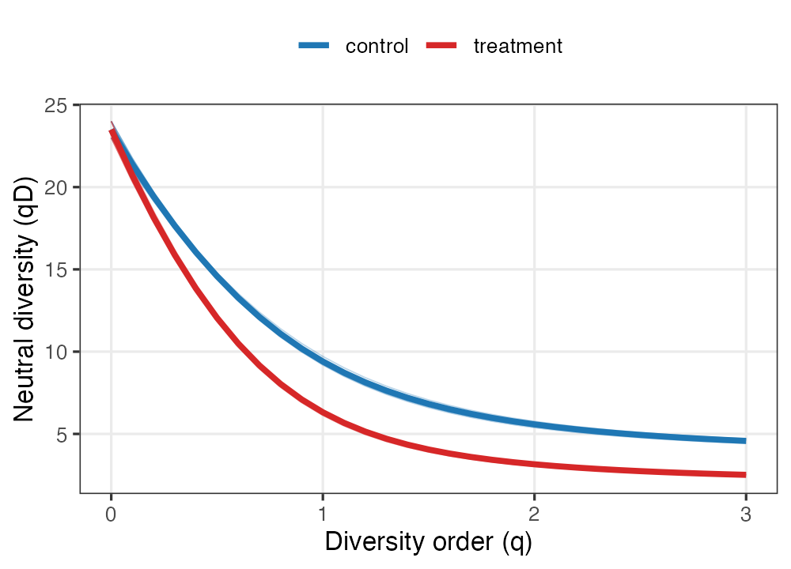

# Use case 2 — Three faces of diversity in a gut microbiome under intervention

Genome-resolved metagenomics summarises a microbial community as a table of
metagenome-assembled genome (MAG) abundances. Each MAG comes with two extra
layers of information that a raw count ignores: its **position on the bacterial
phylogeny** and its **functional attributes** (genome size, GC content, oxygen
tolerance, encoded capabilities). A treatment that reshapes a community may
leave taxon richness untouched while collapsing its evenness, eroding its
phylogenetic breadth, or hollowing out its functional repertoire. `hilldiv3`
measures all three from the same count table and the same function calls, so
the layers can be compared on a common, interpretable scale (effective numbers
of lineages).

## Data

We use the bundled simulated data set: **24 MAGs across 12 host gut samples**,
split into a `control` and a `treatment` group of six. A block of MAGs is
enriched under treatment, so the intervention changes *which* genomes dominate
without removing taxa. `gut_tree` is the genome phylogeny and `gut_traits` a
trait table mixing continuous (`genome_size`, `gc_content`), categorical
(`oxygen`) and binary (`motility`) attributes.

`traits2dist()` turns that mixed trait table into a functional distance with
Gower's coefficient, which handles the different variable types automatically:

```r
library(hilldiv3)

fdist <- traits2dist(gut_traits)   # Gower distance, range 0–0.83
```

## Neutral, phylogenetic and functional diversity from one call

The diversity *type* is chosen by what you supply: nothing extra → neutral,
`tree =` → phylogenetic, `dist =` → functional. The interface never changes.

```r
hilldiv(gut_counts, q = c(0, 1, 2))                # neutral, qD
hilldiv(gut_counts, q = c(0, 1, 2), tree = gut_tree)   # phylogenetic, qPD
hilldiv(gut_counts, q = c(0, 1, 2), dist = fdist)      # functional, qFD
```


The result is a layered story that no single metric could tell (group means):

| | q | control | treatment |
|---|---|---|---|
| Neutral `qD` | 0 | 23.5 | 23.5 |
| | 1 | 9.4 | 6.3 |
| | 2 | 5.6 | 3.2 |
| Phylogenetic `qPD` | 1 | 2.37 | 2.08 |
| Functional `qFD` | 1 | 1.74 | 1.60 |

**Richness (`q = 0`) is identical between groups** — counting MAGs would
conclude the treatment did nothing. Yet as soon as abundance is weighted
(`q = 1, 2`) the treatment community is markedly less diverse: effective
Shannon diversity falls from 9.4 to 6.3 and Simpson from 5.6 to 3.2, because
the enriched block now dominates. The same depression appears in the
phylogenetic and functional numbers (and, for function, already at `q = 0`:
1.79 → 1.66), showing the dominant genomes are also phylogenetically and
functionally redundant with one another. Reading diversity across `q` *and*
across flavours is exactly what separates "nothing changed" from "the
community was hollowed out".

## Profiles confirm a loss of evenness, not richness

```r
plot(hillprof(gut_counts, q = seq(0, 3, by = 0.1)))
```



Control and treatment profiles start together at `q = 0` and fan apart as `q`
rises — the visual fingerprint of an intervention that redistributes abundance
rather than removing taxa.

## Where does the community differ — taxonomically or functionally?

`hillpart()` partitions diversity between the two groups and reports beta, the
effective number of distinct communities. Running it for each flavour shows
*which* axis the treatment shifts:

```r
md <- data.frame(group = rep(c("control", "treatment"), each = 6),
                 row.names = colnames(gut_counts))
hillpart(gut_counts, q = c(0, 1, 2), hierarchy = ~ group, metadata = md)              # neutral
hillpart(gut_counts, q = c(0, 1, 2), hierarchy = ~ group, metadata = md, dist = fdist) # functional
```


Between-group beta grows with `q` for the neutral (1.00 → 1.06 → 1.10) and
**functional** (1.00 → 1.08 → 1.15) decompositions, but stays essentially flat
for the phylogenetic one (β ≈ 1.01). The enriched genomes are scattered across
the phylogeny — so the community's phylogenetic composition barely moves — yet
they are functionally similar to each other, so the *functional* makeup of the
dominant community shifts the most. Distinguishing taxonomic, phylogenetic and
functional turnover on one common beta scale is a core strength of the Hill-
number framework as implemented here.

## Ordination on two different distances

`hillpair()` accepts the same `tree =` / `dist =` switch, so a single workflow
produces ordinations in *neutral* and *functional* space:

```r
dn <- hillpair(gut_counts, q = 1, metric = "C")               # neutral
df <- hillpair(gut_counts, q = 1, metric = "C", dist = fdist) # functional
plot(cmdscale(dn, 2)); plot(cmdscale(df, 2))
```


Both ordinations separate control from treatment, and comparing them shows
whether group structure is driven by *which taxa* or *which functions* differ —
two questions one distance alone cannot disentangle.

## Functional redundancy

Finally, `hillred()` quantifies **functional redundancy**: it fits the
saturating relationship between neutral diversity (number of genomes) and
functional diversity (number of distinct trait profiles) across samples. A
curve that plateaus well below the spread of neutral diversity means many
genomes share functions — a redundant, and therefore functionally resilient,
community.

```r
red <- hillred(gut_counts, q = c(1, 2), dist = fdist)
plot(red)
```


The fitted redundancy is high — **0.72 at `q = 1`** and **0.58 at `q = 2`** —
so adding genomes contributes far less than proportional new function: the gut
community carries substantial functional insurance, even where (as the alpha
analysis showed) the treatment has thinned its effective diversity.

## What this use case shows

From one MAG table plus a genome tree and a trait table, `hilldiv3` produced a
complete three-flavour analysis through one interface: trait-to-distance
conversion (`traits2dist`); neutral, phylogenetic and functional alpha
diversity (`hilldiv`); diversity profiles (`hillprof`); between-group
partitioning for each flavour (`hillpart`); ordinations on neutral and
functional distances (`hillpair`); and functional redundancy (`hillred`). The
unified, type-switching interface is what lets a single study report taxonomic,
phylogenetic and functional diversity side by side, on comparable scales.
